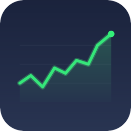

<p align="center">
  
</p>

<h1 align="center">TickerBar</h1>

<p align="center">A free macOS menu bar app for keeping an eye on stocks. No subscription and no paid tier.</p>

<p align="center">
  <a href="https://github.com/TerrifiedBug/TickerBar/releases"></a>
</p>

<p align="center">
  
</p>

## What it does

TickerBar keeps the current price in your menu bar. Pin one stock, or let it rotate through the watchlist while closed markets are skipped.

Open the watchlist to see intraday charts, price alerts, portfolio holdings, and live pre-market, after-hours, or overnight prices when Yahoo provides them. You can search for tickers as you type and give them private display names if you would rather not show the real symbols in your menu bar.

The menu bar has a normal single-line layout and a compact two-line layout. Text size, percentage changes, refresh timing, rotation speed, and the dropdown background are all adjustable.

## Install

### Homebrew

```bash
brew install --cask terrifiedbug/tap/tickerbar
```

Sparkle handles updates inside the app, or you can update through Homebrew:

```bash
brew upgrade --cask tickerbar
```

#### About tap trust

Homebrew 6 requires approval before it loads a non-official tap. The fully qualified install command above trusts only the TickerBar cask.

If you prefer to trust the entire TerrifiedBug tap:

```bash
brew tap terrifiedbug/tap
brew trust terrifiedbug/tap
brew install --cask tickerbar
```

Trusting the whole tap applies to every current and future formula, cask, and command in that repository. The package-specific install command is the narrower default. Homebrew explains the model in its [tap trust documentation](https://docs.brew.sh/Tap-Trust).

### Manual download

1. Download `TickerBar.zip` from the [latest release](https://github.com/TerrifiedBug/TickerBar/releases/latest).
2. Unzip it and move `TickerBar.app` into Applications.
3. Open TickerBar from Applications.

### First launch on macOS

TickerBar currently uses ad hoc signing instead of a paid Apple Developer ID, so macOS may block the first launch. Control-click `TickerBar.app` in Applications, choose **Open**, then confirm **Open** in the dialog.

If macOS still blocks it, remove the quarantine flag:

```bash
xattr -dr com.apple.quarantine /Applications/TickerBar.app
```

## Build it yourself

You need Xcode 15 or newer and macOS 14 or newer.

```bash
git clone https://github.com/TerrifiedBug/TickerBar.git
cd TickerBar
xcodebuild -project TickerBar.xcodeproj -scheme TickerBar -configuration Release -derivedDataPath build build
```

The app will be at `build/Build/Products/Release/TickerBar.app`.

`TickerBar.xcodeproj` is the source of truth for the project. There is no project generator to run.

## Settings

Open the watchlist and click **Settings**. You can change:

- Quote refresh and stock rotation timing
- The pinned stock and compact menu bar layout
- Percentage changes, extended-hours prices, and menu bar text size
- The dropdown background and portfolio currency
- Launch at login and automatic update checks
- Portfolio backup and restore

## Disclaimer

TickerBar is not affiliated with or endorsed by Yahoo. It reads quote data from Yahoo Finance for personal use. Prices can be delayed or incomplete, so check the source before making a trade. Yahoo's terms govern your use of its data.

## License

TickerBar is released under the [MIT License](LICENSE).
